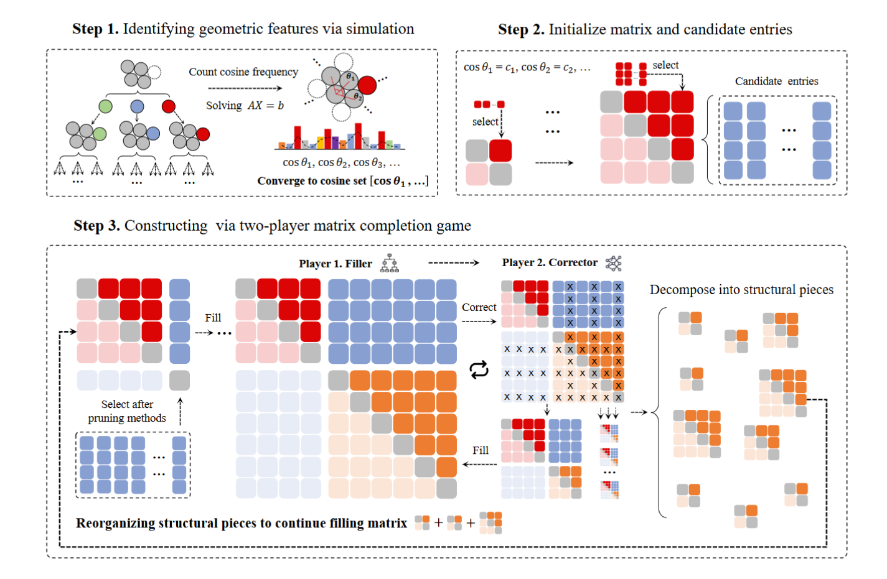

# PackingStar：面向接吻数问题的博弈论强化学习框架

>论文:[Finding Kissing Numbers with Game-theoretic Reinforcement Learning](https://arxiv.org/html/2511.13391v1)

本文介绍了一种名为 **PackingStar** 的多智能体强化学习系统。该系统针对经典的"接吻数问题"（Kissing Number Problem）进行求解。与传统的在高维坐标空间中直接进行搜索的方法不同，PackingStar 将问题转化为**格拉姆矩阵（Gram matrix）域中的双人矩阵补全博弈**。

---

## 核心框架解析

PackingStar 的整体流程分为三个步骤（Step 1 → Step 2 → Step 3），对应：几何特征提取 → 矩阵初始化 → 双人博弈求解，下面逐一展开。

---

### 1. 问题的重新建模：从坐标到格拉姆矩阵

传统方法直接在 $\mathbb{R}^n$ 坐标空间中优化球心位置，随着维度增长会面临两大瓶颈：
- **数值不稳定**：高维坐标运算精度损失严重；
- **计算不可并行**：坐标表示难以利用 GPU 大规模并行。

**PackingStar 的关键洞察**：对于单位球面上的向量，它们之间的几何关系完全由**两两余弦值**（即格拉姆矩阵 $G$ 的元素 $G_{ij} = \langle \mathbf{x}_i, \mathbf{x}_j \rangle$）决定。因此，PackingStar 抛弃坐标表示，直接在格拉姆矩阵 $G \in \mathbb{R}^{m \times m}$ 上操作：
- 矩阵的每一行/列对应一个球心向量；
- 矩阵的大小 $m$ 即对应接吻数（寻找到的互不重叠的球体数量）；
- 约束条件自然地表达为 $G \succeq 0$（半正定）且 $\text{rank}(G) \leq n$（维度约束）。

**优点**：消除了数值不稳定性；所有矩阵运算（Cholesky 分解、特征值判定等）可直接利用 GPU 上的 cuBLAS 库进行大规模并行加速。

---

### 2. 几何特征识别：模拟阶段 (Step 1)

在启动矩阵补全博弈之前，系统需要先确定矩阵元素允许取哪些值——即提取候选接吻构型的**基本几何特征**。

#### 2.1 新球心求解

给定 $\mathbb{R}^n$ 中已有的 $m \geq n-1$ 个球心，系统遍历所有 $(n-1)$ 元组合。设 $\mathbf{x}_1, \dots, \mathbf{x}_{n-1}$ 为选定的球心坐标，构造矩阵 $A = [\mathbf{x}_1^T; \dots; \mathbf{x}_{n-1}^T] \in \mathbb{R}^{(n-1) \times n}$（需满秩），然后求解新球心 $\mathbf{x}$ 使其与这些球相切且在单位球面上：

$$
\begin{cases}
A\mathbf{x} = \mathbf{b}, \\
\|\mathbf{x}\|_2 = 1
\end{cases}
\quad \text{其中 } \mathbf{b} = \frac{1}{2}\mathbf{1}_{n-1}
$$

可行解为：

$$
\mathbf{x} = A^{+}\mathbf{b} \pm \sqrt{1 - \|A^{+}\mathbf{b}\|_2^2} \cdot \mathbf{z}, \quad \mathbf{z} \in \ker(A), \|\mathbf{z}\|_2 = 1
$$

其中 $A^{+}$ 为伪逆。所有可行候选球心被加入搜索空间。

#### 2.2 蒙特卡洛树搜索（MCTS）探索

在候选球心空间中，系统采用 **MCTS** 进行引导式探索。搜索树中每个节点对应一个部分构型 $s_t = \{\mathbf{x}_1, \dots, \mathbf{x}_{m_t}\}$。下一个球心按照上置信界（UCB）公式选择：

$$
\mathbf{x}_t = \arg\max_{\mathbf{x}} \left[ Q(s_t, \mathbf{x}) + c \sqrt{\frac{\ln N(s_t)}{N(s_t, \mathbf{x})}} \right]
$$

其中：
- $Q(s_t, \mathbf{x})$：估计值函数（该候选的历史平均回报）；
- $N(s_t)$、$N(s_t, \mathbf{x})$：节点和候选的访问次数；
- $c > 0$：探索-利用平衡常数。

奖励定义为最终放置的球体总数，反向传播以引导 MCTS 朝更大接吻数的构型搜索。

#### 2.3 余弦值集合的收敛

重复该过程直到无可行球心，统计所有构型中出现的**余弦频率**。频率收敛后，得到一个离散的**余弦值集合 (Cosine set)**：

$$
C_1 = \{\cos\theta_1, \cos\theta_2, \dots, \cos\theta_k\}
$$

这个集合定义了后续矩阵元素的**合法取值范围**——任何被填入格拉姆矩阵的值都必须来自这个集合。例如：
- $K_r(13)$ 配置：$C_1 = C_2 = \{-1, 0, \pm 1/4, \pm 1/2\}$
- $K(12, 1/4)$ 配置：$C = \{-1/2, -1/8, 1/4\}$
- $K(25)$ 配置：$C = \{0, \pm 1/6, \pm \sqrt{6}/12, \pm 1/4, \pm 1/3, \pm \sqrt{6}/6, \pm 1/2\}$

---

### 3. 矩阵初始化 (Step 2)

利用 Step 1 得到的余弦值集合 $C_1$，系统构造初始的部分格拉姆矩阵 $G^{(m_0)} \in \mathbb{R}^{m_0 \times m_0}$。初始化方式有两种：
1. **从零开始**：直接以 $C_1$ 中的合法值填充一个小型种子矩阵；
2. **利用已有结构**：使用先前博弈产生并分解出的子矩阵（见第 5 节）作为初始状态，从而实现有引导的构建。

---

### 4. 双人矩阵补全博弈 (Step 3)

这是强化学习的**核心环节**。两个智能体（Agent）被建模为一个**马尔可夫博弈**中的合作玩家：
- **状态 (State)**：当前格拉姆矩阵 $G^{(m)}$；
- **共享团队奖励 (Reward)**：最终矩阵的对角元素数量，即接吻数；
- **最优联合策略** 通过如下目标求解：

$$
(\pi_1^*, \pi_2^*) = \arg\max_{\pi_1, \pi_2} \mathbb{E}_{g \sim \pi_1, I \sim \pi_2} \left[ \|\text{diag}(G^{(M)}(\{g\}, I))\|_F^2 \right]
$$

#### 4.1 玩家 1：矩阵填充者 (Matrix Filler)

**角色**：逐步向矩阵中添加新行/列（即添加新的球体）。

**动作**：在每一步 $m \geq m_0$，玩家 1 按策略 $\pi_1$ 采样一个动作 $g \sim \pi_1(\cdot \mid G^{(m)})$，将矩阵扩展为：

$$
G^{(m+1)}(g) = \begin{pmatrix} G^{(m)} & g \\ g^\top & 1 \end{pmatrix}
$$

**候选动作集约束**：根据当前矩阵大小分两种情况。

**(a) 当 $m < n$（矩阵尚未满秩）**：

$$
\mathcal{A}^{(m)} = \left\{ g \in C_1^m \;\middle|\; G^{(m+1)}(g) \succeq 0, \;\text{rank}(G^{(m+1)}(g)) = m+1 \right\}
$$

即要求扩展后的矩阵保持半正定，且秩递增（每个新球心线性独立）。

**(b) 当 $m \geq n$（矩阵已满秩）**：

将动作向量 $g$ 拆分为两部分：

$$
g = \begin{pmatrix} g^{(1)} \\ g^{(2)} \end{pmatrix}, \quad g^{(1)} \in \mathbb{R}^{n \times 1}, \; g^{(2)} \in \mathbb{R}^{(m-n) \times 1}
$$

其中 $g^{(1)}$ 对应与前 $n$ 个基向量的余弦值，$g^{(2)}$ 对应与第 $n+1$ 到第 $m$ 个向量的余弦值。此时 $g^{(2)}$ 由 $g^{(1)}$ 唯一确定：

$$
g^{(2)} = G'(G_{1:n,1:n}^{(m)})^{+} g^{(1)}
$$

其中 $G' = G_{n+1:m, 1:n}^{(m)}$。因此候选动作集简化为在前 $n$ 维余弦上的搜索 ：

$$
\mathcal{A}^{(m)} = \left\{ g = [g^{(1)}; g^{(2)}] \;\middle|\; g^{(1)} \in C_1^n, \;\|M^{+}g^{(1)}\|_2 = 1, \;g^{(2)} \in C_2^{m-n} \right\}
$$

其中 $M$ 为 $G_{1:n,1:n}^{(m)}$ 的 $Cholesky$ 因子（$G_{1:n,1:n}^{(m)} = MM^\top$），$\|M^{+}g^{(1)}\|_2 = 1$ 确保新向量在单位球面上。$C_2$ 是预定义的余弦约束集，可以等于 $C_1$，也可以是连续约束，例如：

$$
C_2 = \left\{ g^{(2)} \in \mathbb{R}^{m-n} \;\middle|\; |g_i^{(2)}| \leq 0.5 \right\}
$$

在特定场景下，还可以施加额外约束集 $C^*$（如限定只能来自 Leech 格最短向量集）：

$$
\mathcal{A}^{(m)} \leftarrow \mathcal{A}^{(m)} \cap C^*
$$

**策略实现**：采用**基于树搜索的强化学习方法**。节点值根据每轮结束后的团队奖励进行更新。

#### 4.2 玩家 2：矩阵修正者 (Matrix Corrector)

**角色**：在玩家 1 完成一轮填充后，利用**全局视角**识别并剔除次优条目。

**为什么需要玩家 2**：
- 在早期探索阶段，候选空间指数级庞大，玩家 1 只能观察到局部矩阵信息，错误放置不可避免；
- 玩家 2 通过延迟的、选择性的修正（delayed and selective corrections），利用对整个矩阵更全局的理解，动态移除无效或不一致的条目，压缩玩家 1 的搜索空间。

**动作**：当玩家 1 完成 $M$ 步填充（或无可行 $g$ 时），玩家 2 采样一个索引集：

$$
I \sim \pi_2(\cdot \mid G^{(M)})
$$

其中 $\pi_2(\cdot \mid G^{(M)})$ 是在 $\{1, 2, \dots, M\}$ 上的概率分布。修正后的矩阵为：

$$
G^* = G^{(M)}_{I, I}
$$

即保留索引集 $I$ 对应的行和列，剔除其余部分。

**策略实现**：通过**神经网络参数化**，使用**策略梯度**方法进行端到端优化。

#### 4.3 协同博弈动态 (Cooperative Game Dynamics)

两个玩家在 $N$ 轮中交替行动，形成"**填充→修正→填充→修正→...**"的迭代循环：

$$
G^{(M)} \xrightarrow{\pi_2} G^* \xrightarrow{\pi_1} G^{(M')} \xrightarrow{\pi_2} \cdots
$$

具体流程：
1. **玩家 1 填充**：从当前矩阵出发，逐步添加新行/列，直到达到预设步数上限或无可行候选；
2. **玩家 2 修正**：审视完整矩阵，剔除次优条目，产生精简后的可行矩阵 $G^*$；
3. **玩家 1 恢复填充**：从 $G^*$ 出发，在新的（被压缩过的）可行集 $\mathcal{A}^{(M-|I|)}$ 中继续填充；
4. **终止条件**：当玩家 1 无法再添加任何条目，且玩家 2 也无法通过修正进一步改善时，博弈结束。

**参数联合更新**：每轮结束后，基于共同的团队奖励 $R_{\text{team}} = \|\text{diag}(G^{(M)})\|_F^2$，**同时**更新：
- 玩家 1 的树搜索统计信息（节点值函数 $Q$ 和访问计数 $N$）；
- 玩家 2 的神经网络参数（通过策略梯度）。

这种联合更新使两个玩家能够**相互改进**：玩家 2 的修正帮助玩家 1 避开死胡同，而玩家 1 的更好填充为玩家 2 提供更高质量的矩阵进行修正。

---

### 5. 结构分解与迭代引导 (Matrix Decomposition and Initialization)

为了应对极大维度下的组合爆炸，PackingStar 引入了**迭代分解机制**，这是系统能扩展到高维的关键。

#### 5.1 子矩阵分解

当一轮博弈结束并得到最终矩阵 $G^{(M)}$ 后，系统将其分解为若干子矩阵：

$$
G^{(M)}_{J, J}, \quad J \subset \{1, 2, \dots, M\}
$$

每个索引集 $J$ 选取 $G^{(M)}$ 的一个行列子集，对应的子矩阵捕获了**具有代表性的几何模式**，作为蒸馏出的**结构化基底（structural bases）**。

#### 5.2 并行初始化后续博弈

在随后的博弈中，每个子矩阵 $G^* = G^{(M)}_{J, J}$ 可用作新一轮博弈的**初始状态**。多个子矩阵可同时被用于初始化**并行的填充博弈**，使系统能够同时探索高维搜索空间的不同区域。

这一机制将**无约束的组合探索**转化为**有引导的构建**：
- 每次博弈不再从零开始，而是从有意义的子结构出发；
- 子结构施加了结构化约束，大幅缩小搜索空间；
- 不同子结构引导探索不同的几何方向，增加了发现多样构型的机会。

---

### 6. 与 AlphaEvolve 的关键区别

| 对比维度 | AlphaEvolve | PackingStar |
|---------|-------------|-------------|
| **搜索空间** | 直接优化 $\mathbb{R}^n$ 中的显式坐标 | 在格拉姆矩阵域中操作余弦值 |
| **可扩展性** | 数值不稳定，随维度指数增长；增加算力无法根本克服 | 严格几何约束 + 子结构分解压缩空间，可扩展到更高维 |
| **发现方式** | 在已知构型上进行坐标微调（"optimize" geometry） | 从零发现全新构型（"create" geometry） |
| **结构可解释性** | 11 维改进缺乏清晰几何结构 | 发现的构型具有明确数学结构（如 Leech 格子结构） |
| **可迁移性** | 依赖特定维度的非 jammed 构型，难以迁移 | 统一框架适用于多个维度 |

---

## 计算实现

PackingStar 的设计充分利用了矩阵域操作的并行性：
- 所有矩阵运算（Cholesky 分解、半正定判定、秩约束检查等）通过 NVIDIA GPU 上的 **cuBLAS** 库实现大规模并行；
- 博弈模拟和模型训练均可并行加速；
- 子矩阵分解后的多个后续博弈可同时并行运行。

---

## 主要成果

通过上述框架，PackingStar 在无需任何人类先验知识的情况下，取得了以下突破：

| 维度范围 | 成果 |
|---------|------|
| **25-31 维** | 全部超越 2016 年最佳下界。25 维发现 197056（+8），31 维发现 238350（+5476） |
| **13 维** | 首次突破 1971 年以来的有理构型记录，从 1130 提升到 1146 |
| **广义接吻数** | 多个维度在 $\alpha=1/3$ 和 $\alpha=1/4$ 约束下创新纪录 |
| **新构型多样性** | 仅 14 维就发现超过 6000 种新构型 |

特别值得注意的是，部分新发现的构型**挑战了长期以来的对径（antipodal）范式**——它们展现出非对称但高度规则的几何模式，并揭示了与有限单群之间的深层代数对应关系。这些结构启发数学家设计出了进一步改进的构造，例如 22 维的改进，展现了 AI 发现与数学理论之间的正向反馈循环。

---

## 总结

PackingStar 的核心创新在于三层设计：

1. **问题重建模**：将高维几何组合问题转化为格拉姆矩阵域中有严格数学约束的矩阵补全问题；
2. **双智能体合作博弈**：填充者（树搜索 RL）负责构建，修正者（神经网络策略梯度）负责纠错，两者通过共享奖励联合优化；
3. **子结构分解与迭代引导**：从已发现构型中提取代表性子结构，作为后续博弈的初始化，将无约束探索转化为有引导的构建。

这三层机制共同使得在指数级庞大的搜索空间中进行高效的强化学习成为可能，最终实现了对接吻数问题多个维度的突破性发现。

